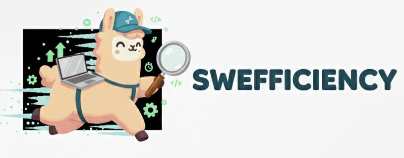

<div align="center">
  
</div>


<p align="center">
  <a href="https://swefficiency.com/">
    
  </a>
  <a href="https://huggingface.co/datasets/swefficiency/swefficiency">
    
  </a>
  <a href="TODO: paper link">
    
  </a>
</p>

---

# SWE-fficiency: Can Language Models Optimize Real World Repositories on Real World Worloads?

**TL;DR** — SWE-fficiency is a *repository-level* benchmark for **performance optimization** (not bug fixing). Each task ships:
- a full codebase,
- a targeted **performance workload** to speed up,
- and the subset of repo **correctness tests** that must remain green.

We evaluate patches by applying them, running the correctness suite, and measuring runtime speedups vs. the *expert (human) PR*, reporting **Speedup Ratio (SR)**.

---

## 🚀 What is SWE-fficiency?

SWE-fficiency evaluates *pass-to-pass* performance engineering: start from a codebase and a slow workload, improve runtime, and **don’t break behavior**. The focus is on **investigation** (profiling/localization) and **correctness-preserving** edits—mirroring how performance engineers work day-to-day.

### Highlights
- **Real repos, real workloads**: **498** tasks from **9** major Python libraries—**numpy, scipy, pandas, scikit-learn, matplotlib, xarray, sympy, dask, astropy**.
- **Correctness-preserving**: Edits must pass the repo’s own unit/integration tests *covering the changed code*.
- **Reproducible evaluation**: Prebuilt, containerized environments; per-task CPU/memory pinning recommended (**4 vCPUs, 16 GB RAM** per worker).
- **Metric**: **Speedup Ratio (SR)** = *(LM speedup) / (expert speedup)*; aggregate with a harmonic mean. SR>1.0 means you beat the human baseline.

### Why this matters
Performance improvements in widely used libraries have outsized impact. SWE-fficiency isolates the open-ended challenge: **find bottlenecks, propose safe optimizations, and prove correctness** against the repo’s own tests—at repository scope.

---

## 📦 Install & Environment

We recommend Python 3.11 and a Linux host. The benchmark is installable via `pip` in editable mode.

```bash
conda create -n swefficiency python=3.11 -y
conda activate swefficiency

# In the repo root
pip install -e .
````

### VM / Container Setup (recommended for reproducibility)

For faithful reproduction of paper results, use a large VM (e.g., GCP `n2-standard-64`) and run the setup scripts to configure Docker and CPU pinning:

```bash
# From repo root
bash scripts/vm/setup_docker.sh
bash scripts/vm/setup_vm.sh
```

> Notes
>
> * Prebuilt per-instance images are used for evaluation.
> * Each worker is pinned to **4 vCPUs** and assigned **16 GB** RAM to minimize cross-run interference.

---

## 🧰 Dataset

* **Location**: [Hugging Face — swefficiency/swefficiency](https://huggingface.co/datasets/swefficiency/swefficiency)
* **Task structure** (per instance):

  * Repo snapshot + diff metadata
  * A **performance workload** script that exhibits a measurable speedup under the expert patch
  * The **set of repo tests** whose coverage intersects the expert diff (the “guarding” tests)

> The workloads are **separate from correctness tests** (as in real projects). The benchmark rejects instances whose speedups are not statistically significant in a controlled environment.

---

## 📊 Evaluation

### Metric: Speedup Ratio (SR)

For each instance:

* Let `T_pre` be workload runtime pre-edit.
* Let `T_post_gold` be runtime after applying the **expert** patch.
* Let `T_post_lm` be runtime after applying your model’s patch.

**Expert speedup** = `T_pre / T_post_gold`
**Model speedup** = `T_pre / T_post_lm`
**Speedup Ratio (SR)** = `Model speedup / Expert speedup`.

* We aggregate SR across tasks with the **harmonic mean**.
* If a patch **fails correctness tests** or **doesn’t apply**, the instance is scored as if **no LM edit** were attempted (`T_pre / T_post_lm = 1`).

### Two-stage evaluation pipeline

1. **Run Patch Evaluation** — Apply predicted patches, run guarding correctness tests, run the performance workload; store logs and raw measurements.
2. **Check Evaluation** — Aggregate JSON/CSV artifacts into final metrics (SR, pass rates, etc.).

See `scripts/eval/README.md` for detailed CLI usage and examples.

---

## 🛠️ Generation (Agents & Harness)

We provide integration points for popular SWE agent harnesses lie OpenHands and SWE-agent via already containerized docker containers (`ghcr.io/swefficiency/swefficiency-images:<instance_id>`).

We ship **prebuilt Docker images** for generation to match the evaluation environment and avoid dependency drift.

> Recommended per-task limits (matching paper setup): **3 hours** wall-clock, **100** max actions/turns; be generous with workload timeouts (since tests or workloads can be substantial).

---

## 🔬 Reproducibility Tips

* Use the provided **container images** (prebuilt for each instance).
* **Pin CPU and memory** per worker (4 vCPUs / 16 GB RAM). See `scripts/vm/` scripts for more details.
* Pre-built images include everything needed.

---

## 📈 Baseline Snapshot

We include reference results in the paper across several modern LMs using OpenHands/SWE-agent. Overall, agents today are **far from expert parity** (SR ≪ 1×) and frequently introduce correctness regressions when attempting optimizations. See paper for full tables and analysis.

---

## 🧭 Project Structure (high level)

```
.
├── scripts/
│   ├── eval/           # evaluation runner + aggregator
│   ├── vm/             # docker & VM pinning helpers
│   └── gen/            # (optional) agent harness helpers
├── swefficiency/       # python package (cli, utils, loaders)
├── assets_figures/     # logos, diagrams
└── README.md
```

---

TODO: Add 📚 citation + 🤝 acknowledgments.
